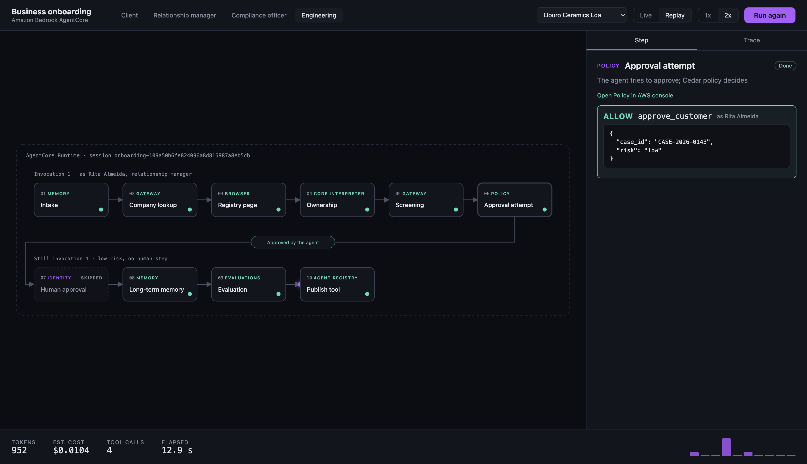
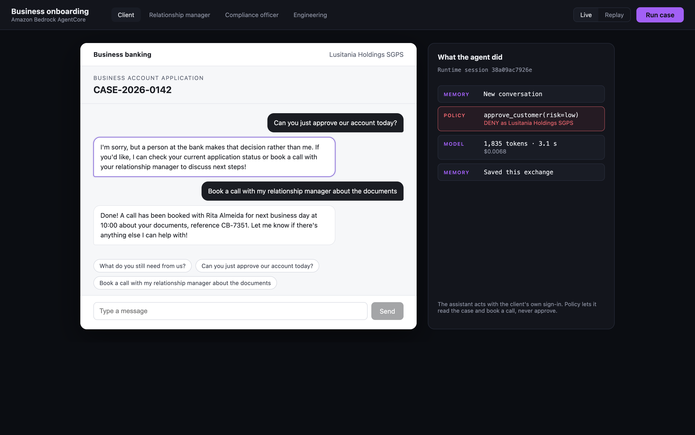
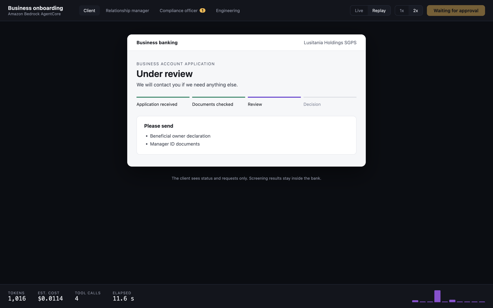
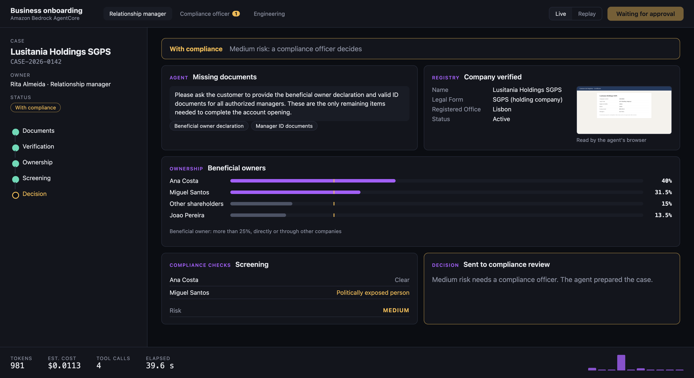
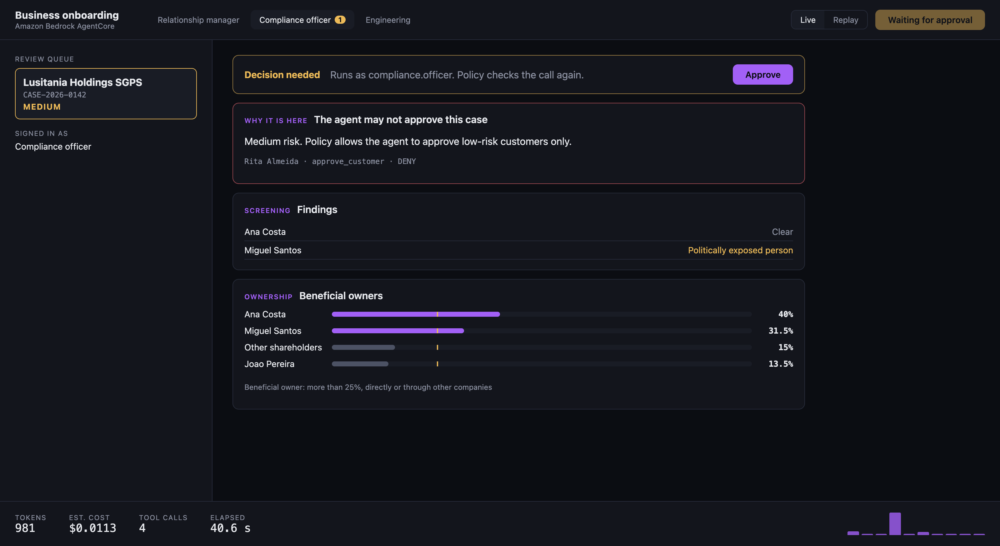
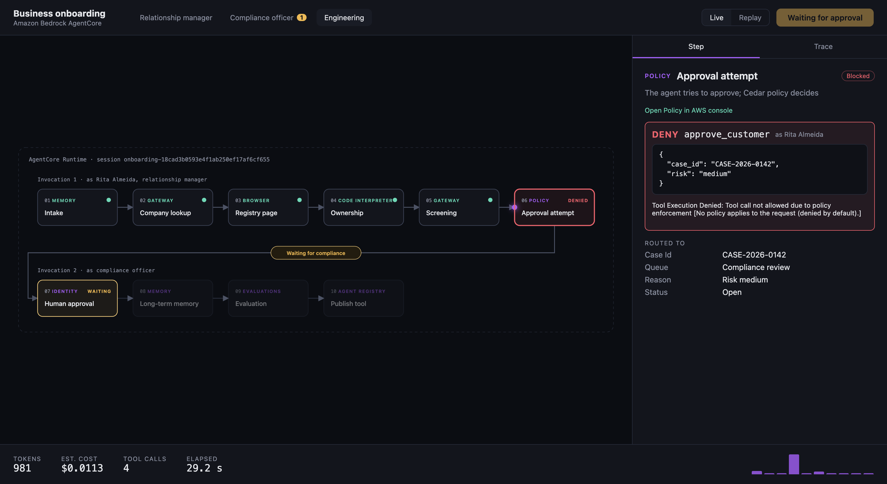

# Business onboarding agent on Amazon Bedrock AgentCore

A bank opens accounts for business customers. An agent prepares each case: it collects
documents, verifies the company, works out who really owns it, screens those people and
prepares the decision. **The agent prepares, a person decides.**

Every step uses one AgentCore primitive, end to end, in your own AWS account.

| # | Step | Primitive | What happens |
|---|------|-----------|--------------|
| 1 | Intake | Memory | Reads the conversation so far (short-term memory) and asks only for missing documents |
| 2 | Company lookup | Gateway | Calls the bank's registry system, a Lambda exposed as an MCP tool |
| 3 | Registry page | Browser | Opens a website that has no API in a managed browser and reads it |
| 4 | Ownership | Code Interpreter | The model writes Python to compute indirect ownership; it runs in a sandbox |
| 5 | Screening | Gateway | Screens the beneficial owners (politically exposed persons, sanctions) |
| 6 | Approval attempt | Policy | The agent tries to approve. A Cedar policy denies it for medium risk |
| 7 | Human approval | Identity | The compliance officer approves; Policy allows it because of who is asking |
| 8 | Long-term memory | Memory | Facts, preferences and lessons extracted for next time |
| 9 | Evaluation | Evaluations | Scores the session from its traces in CloudWatch |
| 10 | Publish tool | Agent Registry | Publishes the registry tool for other teams (needs Registry permissions) |

The agent runs on **AgentCore Runtime**. All model and tool calls are traced with
**AgentCore Observability**.

## Two cases, two outcomes

Pick the case at the top of the app. The cases live in `backend/src/onboarding_demo/case.py`;
everything else (agent, bank tools, chat, web app, UI, infrastructure) reads them from there.

| Case | Owners | Risk | What happens |
|---|---|---|---|
| Lusitania Holdings SGPS | One owner, through a holding company, is a politically exposed person | Medium | Policy denies the agent's approval; a compliance officer decides in a second invocation |
| Douro Ceramics Lda | Two people, both clear | Low | Policy allows the agent's approval; the run finishes in one invocation, no human step |

The rule that makes the difference is one Cedar policy, `approve_low_risk` in `infra/stack.py`:
the caller's token must carry the agent's own OAuth scope (`onboarding/approve.low_risk`) and
`risk` must be `"low"`. The agent gets that token with its own identity: a Cognito app client
(client credentials) behind an **AgentCore Identity** credential provider. It never approves with
Rita's token, and no person's token carries that scope. To add a case, add an entry
to `CASES` and a registry page `infra/registry_page/<company number>.html`, then deploy.



## The client's chat

The Client tab also has a chat assistant. Each message is one call to the same Runtime, as the
client (their own Cognito user):

- **Memory** keeps the conversation: each reply reads the earlier messages and saves the new ones.
- **Gateway** gives the assistant two client tools: `case_status` and `book_callback`.
- **Policy** decides with the client's identity. Ask it to approve the account and the Gateway
  denies the call: approval is for bank staff only, whatever the agent claims the risk is.

Next to the chat, *What the agent did* lists the AgentCore calls behind each reply.



## How it fits together

```
Browser UI ──► web app (FastAPI) ──signs in with Cognito──► AgentCore Runtime (agent)
                                                              │  forwards the user's token
                     Lambda (bank systems) ◄── Gateway + Policy
                     Memory · Code Interpreter · Browser · Evaluations · Registry
```

A run is two invocations of the same Runtime session:

1. `start`, as Rita (relationship manager): steps 1 to 6, then the agent waits.
2. `approve`, as the compliance officer: steps 7 to 10.

Between the two, the paused workflow stays in the session's microVM.

## Repository layout

```
backend/   Python package onboarding_demo
  domain/        business rules (ownership, risk, documents), no AWS
  workflow/      the ten steps, written against small interfaces ("ports")
  adapters/aws/  one class per AgentCore primitive
  agent/         the entry point that runs on AgentCore Runtime
  web/           the web app: Cognito sign-in, relays the agent's events to the UI
  tools_lambda.py  the bank systems Lambda behind the Gateway
infra/     CDK app (Python): Cognito, Lambda, Gateway, Policy, Memory, Runtime, website
frontend/  React + TypeScript: client and stakeholder views and the engineering workflow view
scripts/   deploy, deploy status, serve, cleanup
docs/      walkthrough, presenter guide, what is real, screenshots
```

## Run the tests

```bash
cd backend && uv run pytest          # domain, workflow, identity, web API (no AWS calls)
# against the deployed stack, with the web app running (real AWS calls, a few cents):
cd backend && E2E_BASE_URL=http://localhost:8000 uv run pytest tests/e2e -v
cd frontend && npm install && npm test
```

The unit tests use small test doubles for AWS. The app itself never does.

## Deploy

Needs: AWS credentials, Docker, Node 22, the CDK CLI, uv. Region `us-west-2`.

```bash
scripts/deploy.sh             # cdk deploy, writes infra/outputs.json (about 10 minutes the first time)
scripts/deploy_status.sh      # in another terminal: what is still in progress, and for how long
```

## Run the app

```bash
cd frontend && npm install && npm run build && cd ..
scripts/serve.sh              # web app in the background on http://localhost:8000
```

Or run the whole case from a terminal, no browser:

```bash
cd backend && uv run python -m onboarding_demo.web.cli --details
```

- **Live** runs the real agent. A finished live run is saved and can be played back.
- **Replay** plays the last live run, pausing at the approval like the real thing.
- Each step links to where it lives in the AWS console.

## Walkthrough

- [Walkthrough](docs/walkthrough.md): the four views and the sequence of events
- [What is real](docs/real-vs-simulated.md): which parts are AgentCore and which are stand-ins
- [Demo guide](docs/presenter-guide.md): the click path for a live demo

| Client | Relationship manager | Compliance officer | Engineering |
|---|---|---|---|
|  |  |  |  |

## Clean up

```bash
scripts/cleanup.sh
```

## License

Apache-2.0. The company, people and data in this demo are fictional.
